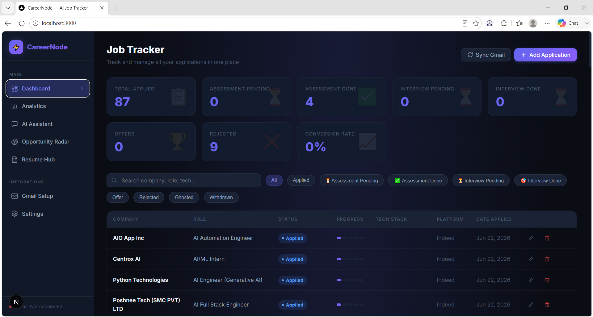

# CareerNode 🚀

**CareerNode** is a personal, AI-powered job application tracking system designed for engineers. It connects directly to your Gmail to automatically scan for application updates, extracts details using Gemini AI, and manages your entire job hunt pipeline from a sleek, localized dashboard.

 
---


## 🌟 Key Features

- **📩 Automated Email Sweeping:** Connects via IMAP to your Gmail account. It scans for application receipts, assessment invites, and interview schedules, automatically updating your pipeline.
- **🧠 AI-Powered Parsing:** Uses Google's **Gemini 3.5 Flash** to extract the exact Company, Role, and Application Status from complex and noisy recruiter emails.
- **📊 Smart Dashboard:** A Next.js front-end that visually maps your progress through specific stages (Assessment Pending, Interview Pending, Offers, etc.) and calculates your conversion rates.
- **🤖 Embedded AI Assistant:** A personal career coach built into the app. Chat with Gemini to generate custom cover letters, get tailored interview prep, or summarize your application database.
- **📂 Resume & Portfolio Context:** Upload your resumes and portfolio projects. The AI assistant automatically uses them as context when generating mock interviews or cover letters.

---

## 🏗️ Architecture & Project Structure

CareerNode is a modern, decoupled web application built specifically for self-hosting:
- **Frontend:** Next.js 14, React, Tailwind CSS.
- **Backend:** Python, FastAPI, Motor (Async MongoDB), APScheduler (Background jobs).
- **Database:** MongoDB.
- **AI Integration:** Google Generative AI (Gemini).

### Folder Structure
```text
CareerNode/
├── .gitignore          # Keeps your .env and credentials safe
├── README.md           # This documentation file
├── start.bat           # 1-click launch script (Windows)
├── backend/            # The Python FastAPI Server
│   ├── main.py         # Entry point & CORS setup
│   ├── requirements.txt# All Python dependencies
│   ├── .env            # (You create this!) Holds your API keys
│   ├── routers/        # API endpoints (jobs, ai, analytics, email)
│   ├── services/       # Email sweeping & Gemini parsing logic
│   └── models/         # MongoDB schemas
└── frontend/           # The Next.js React App
    ├── package.json    # Node.js dependencies
    ├── src/
    │   ├── app/        # Dashboard & AI Assistant pages
    │   ├── components/ # Reusable UI components
    │   └── lib/        # API client and utility functions
```

---

## ⚠️ Important Note: Single-User Application
CareerNode is currently built as a **Personal, Single-User Application**. 
If you deploy this to the internet (e.g., via Vercel/Render), **do not share the URL publicly**, as there is no user login system. Anyone who visits the URL will see your database. 

If you are a developer looking to use CareerNode, you must **fork this repository and deploy your own private instance**, providing your own API keys.

---

## 🚀 How to Run Locally

### Prerequisites
1. **Node.js** (v18+)
2. **Python** (v3.10+)
3. **MongoDB** (Local or MongoDB Atlas)
4. A **Gemini API Key** (Get one free from Google AI Studio)
5. A **Gmail App Password** (For email sweeping)

### 1. Setup the Backend
Open a terminal and navigate to the `backend` folder:
```bash
cd backend
python -m venv venv
source venv/bin/activate  # On Windows use: venv\Scripts\activate
pip install -r requirements.txt
```

Create a `.env` file in the `backend` directory:
```env
# Database
MONGODB_URL=mongodb://localhost:27017
DATABASE_NAME=careernode

# Gmail IMAP Credentials
IMAP_SERVER=imap.gmail.com
IMAP_PORT=993
IMAP_USER=your_email@gmail.com
IMAP_PASSWORD=your_16_digit_app_password

# Gemini AI Key
GEMINI_API_KEY=your_gemini_api_key

# Frontend URL for CORS
FRONTEND_URL=http://localhost:3000
```

Start the FastAPI server:
```bash
python main.py
```

### 2. Setup the Frontend
Open a new terminal and navigate to the `frontend` folder:
```bash
cd frontend
npm install
```

Start the Next.js development server:
```bash
npm run dev
```

The app will be running at [http://localhost:3000](http://localhost:3000).

---

## ☁️ How to Deploy (For Free)

To host your own private instance of CareerNode on the cloud:

1. **Database:** Create a free cluster on [MongoDB Atlas](https://www.mongodb.com/atlas/database) and get your connection string.
2. **Backend:** Push your code to GitHub and connect it to **Render** or **Railway**. Set the Environment Variables (`MONGODB_URL`, `IMAP_USER`, `IMAP_PASSWORD`, `GEMINI_API_KEY`) in their dashboard.
3. **Frontend:** Connect your GitHub repo to **Vercel**. Set `NEXT_PUBLIC_API_URL` to the URL of your deployed backend.

*(Remember to keep your `.env` file local and never commit it to GitHub!)*

---

## 📄 License
MIT License - Free to use and modify.
